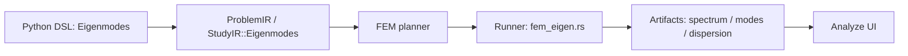

# Fullmag: audyt kodu `Eigenmodes` / spektrum `k=0` i `k≠0`, porównanie z COMSOL oraz plan refaktoryzacji i rozbudowy frontendu

**Data audytu:** 2026-04-08  
**Repozytorium:** `MateuszZelent/fullmag`  
**Zakres:** statyczny audyt kodu, architektury, artefaktów i UI.  
**Tryb pracy:** analiza kodu i dokumentacji, bez uruchamiania benchmarków liczbowych.  
**Punkt odniesienia:** COMSOL Micromagnetics Module, w szczególności workflow frequency-domain / eigenfrequency / Floquet periodic BC.

---

## 0. Cel raportu

Celem tego raportu jest odpowiedzieć na trzy praktyczne pytania:

1. **Jaki jest rzeczywisty stan implementacji Fullmag dla problemu własnego fal spinowych?**
   - osobno dla **`k=0`**,
   - osobno dla **`k≠0`** i dyspersji,
   - osobno dla tego, co już działa w sensie „end-to-end”, a co jeszcze jest tylko częściowo prawdziwe semantycznie albo fizycznie.

2. **Na ile obecna implementacja odpowiada modelowi COMSOL-a?**
   - w teorii,
   - w strukturze solvera,
   - w organizacji workflow od równowagi statycznej do modów i dyspersji.

3. **Jak sensownie rozbudować backend i frontend, nie niszcząc tego, co już istnieje?**
   - z naciskiem na artefakty,
   - śledzenie branchy,
   - prezentację modów,
   - prezentację spektrum,
   - prezentację relacji dyspersji,
   - diagnostykę i porównania uruchomień.

---

## 1. Executive summary

### 1.1. Najkrótsza diagnoza

Fullmag **ma już realny pipeline eigenmodes** dla FEM i nie jest to już tylko plan albo szkic.  
W repo są obecne:

- publiczne API Python dla `Eigenmodes`,
- reprezentacja `StudyIR::Eigenmodes`,
- planner FEM dla ścieżki eigen,
- runner `fem_eigen.rs`,
- eksport artefaktów typu:
  - spectrum,
  - mode fields,
  - dispersion CSV,
- frontendowe komponenty Analyze do oglądania:
  - spektrum,
  - modów,
  - dyspersji.

To jest ważne, bo część dokumentów w repo opisuje stan starszy i sugeruje, że modułu modalnego jeszcze nie ma. To już nie jest prawda.

### 1.2. Co działa naprawdę dobrze

Najbardziej dojrzała jest dziś ścieżka:

- **pojedyncze obliczenie własne FEM**,
- dla **jednego stanu równowagi**,
- z eksportem **listy częstotliwości** i **wybranych pól modów**,
- z podstawowym wsparciem dla:
  - `free`,
  - `pinned`,
  - `periodic`,
  - `floquet`,
  - `surface_anisotropy`.

Krótko mówiąc: **`k=0` jako MVP działa pionowo przez cały stos**, od DSL do UI.

### 1.3. Gdzie jest największa luka

Największy problem nie polega dziś na braku UI ani na braku całego solvera, tylko na tym, że:

1. **`non-k0` jest semantycznie obecne, ale w praktyce jest to tylko pojedynczy punkt Blocha/Floqueta**, nie pełny, pierwszoklasowy workflow dyspersyjny.
2. **obecny operator własny jest dalej operatorem uproszczonym**, bliższym referencyjnej skalarnej projekcji niż pełnej frequency-domain linearized LLG znanej z COMSOL-a.
3. **dyspersja nie jest jeszcze osobnym, pełnym study** ani pełnym sweepem ścieżki `k`, tylko raczej:
   - pojedynczym solve’em dla jednego `k_vector`,
   - z eksportem tabelki nazwanej „dispersion”.

### 1.4. Sedno porównania z COMSOL-em

COMSOL-owy model frequency-domain robi rzecz dużo bardziej fizycznie pełną:

- linearyzuje LLG wokół `m0`,
- używa zespolonych amplitud `δm`,
- utrzymuje warunek styczności `m0 · δm = 0`,
- obsługuje Floquet periodic boundary condition jako naturalny element studium własnego,
- rozróżnia:
  - **Eigenfrequency**,
  - **Frequency Domain** (wymuszoną odpowiedź),
  - dziedziczenie równowagi z relaksacji time-domain.

Fullmag dziś jest bliżej tego workflow niż kilka tygodni czy miesięcy temu, ale **jeszcze nie ma pełnej zgodności fizycznej i semantycznej**.

### 1.5. Moja rekomendacja strategiczna

Nie przepisywać tego od zera. To byłby klasyczny ludzki odruch pod tytułem „już prawie działa, więc wyrzućmy wszystko”.

Najlepsza ścieżka to:

1. **ustabilizować semantykę i artefakty**,
2. **domknąć prawdziwy multi-`k` sweep i tracking branchy** na obecnym solverze referencyjnym,
3. **jasno oznaczyć, że to jest model referencyjny / scalar-projected**,
4. dopiero potem
5. **wymienić jądro operatora na pełne tangent-plane linearized LLG**,
6. bez rozwalania:
   - DSL,
   - IR,
   - schematów artefaktów,
   - frontendu Analyze.

To daje sensowną ścieżkę rozwoju produktu i minimalizuje koszt wyrzucania pracy do kosza, co jak wiadomo jest jedną z ulubionych dyscyplin inżynierii oprogramowania.

---

## 2. Materiał źródłowy

### 2.1. Dokumenty odniesienia

Analiza była oparta o trzy grupy materiałów:

1. **Repo Fullmag**
   - kod Pythona, Rusta i frontendu,
   - aktualne przykłady,
   - noty fizyczne i plany w repo.

2. **COMSOL Blog**
   - „Micromagnetic Simulation with COMSOL Multiphysics”.

3. **Instrukcja modułu COMSOL Micromagnetics**
   - załączony podręcznik `Micromagnetics Module User’s Guide (V2.13)`.

### 2.2. Najważniejsze pliki z repo przejrzane w audycie

#### Backend / IR / runner

- `packages/fullmag-py/src/fullmag/model/study.py`
- `packages/fullmag-py/src/fullmag/model/outputs.py`
- `crates/fullmag-ir/src/lib.rs`
- `crates/fullmag-plan/src/fem.rs`
- `crates/fullmag-runner/src/fem_eigen.rs`
- `crates/fullmag-runner/src/artifacts.rs`
- `crates/fullmag-runner/src/artifact_pipeline.rs`
- `examples/fem_eigenmodes.py`

#### Dokumentacja w repo

- `docs/physics/0600-fem-eigenmodes-linearized-llg.md`
- `docs/physics/0600-fem-eigenmodes.md`
- `docs/plans/active/fullmag_fem_eigenmodes_plan_update_2026-03-30.md`

#### Frontend

- `apps/web/components/analyze/ModeSpectrumPlot.tsx`
- `apps/web/components/analyze/DispersionBranchPlot.tsx`
- `apps/web/components/analyze/EigenModeInspector.tsx`
- `apps/web/components/analyze/eigenTypes.ts`
- hook ładowania artefaktów Analyze (`useCurrentAnalyzeArtifacts.ts`)

### 2.3. Zastrzeżenie metodologiczne

To jest **audyt statyczny**, czyli:

- czytałem kod,
- śledziłem przepływ danych,
- porównałem architekturę z COMSOL-em,
- przeanalizowałem semantykę artefaktów i UI.

Nie wykonywałem w tym audycie:

- uruchomień solvera,
- profilowania wydajności,
- benchmarków liczbowych,
- porównań widm z COMSOL-em na tym samym modelu.

Wniosek jest więc bardzo wartościowy architektonicznie i fizycznie, ale **nie zastępuje jeszcze benchmarków liczbowych**. To trzeba dopisać jako osobny etap walidacyjny.

---

## 3. Jak COMSOL modeluje ten problem i co z tego wynika dla Fullmag

## 3.1. Frequency-domain w COMSOL-u nie jest „ładniejszym eksportem FFT”, tylko osobną fizyką

W manualu COMSOL-owego modułu frequency-domain podstawą jest **linearyzacja równania LLG** wokół równowagi `m0`.  
To jest kluczowe, bo oznacza, że solver nie robi:

- brute-force time stepping,
- potem FFT,
- potem zgadywania modów,

tylko rozwiązuje **bezpośrednio problem częstotliwościowy / własny** dla perturbacji `δm`.

### 3.1.1. Główna idea teoretyczna

W uproszczeniu:

- `m = m0 + δm e^{iωt}`,
- `H_eff = h0_eff + δh_eff e^{iωt}`,
- zachodzi warunek `δm ⟂ m0`,
- a samo równanie jest rozwiązywane w postaci frequency-domain.

Z punktu widzenia architektury Fullmag to daje cztery obowiązki:

1. trzeba umieć uzyskać sensowne `m0`,
2. trzeba umieć złożyć operator linearyzowany wokół `m0`,
3. trzeba umieć narzucić geometrię przestrzeni stycznej,
4. trzeba umieć rozróżnić:
   - study własne,
   - study wymuszone,
   - sweep po `k`.

### 3.1.2. Zasada „równowaga najpierw, mody później”

COMSOL bardzo wyraźnie oddziela:

- etap relaksacji / znalezienia stanu równowagi,
- etap frequency-domain / eigenfrequency.

To jest bardzo dobra organizacja i Fullmag już częściowo to przejął.

W praktyce oznacza to, że:
- `equilibrium_source="provided"` ma sens dla prostych przypadków,
- `equilibrium_source="relax"` jest konieczne dla wielu rzeczywistych tekstur,
- `equilibrium_source="artifact"` jest niezbędne dla workflowów typu:
  - skyrmion,
  - domain wall,
  - tekstury z relaksacji poprzedniego runu.

### 3.1.3. Floquet BC jako centralny element dla `k≠0`

W manualu COMSOL-a Floquet periodic boundary condition ma postać:

`δm_dst = δm_src * exp(- i k_F · (r_dst - r_src))`

To oznacza, że:
- `non-k0` nie jest osobnym zjawiskiem na poziomie solvera,
- to jest **ten sam problem własny**, tylko z fazowym warunkiem okresowym.

To jest bardzo ważna wskazówka architektoniczna dla Fullmag:
- nie trzeba robić osobnego „magicznego” solvera dyspersji,
- trzeba zrobić **dobry eigen solver z dobrym `k_sampling`**.

## 3.2. Co COMSOL rozróżnia, a Fullmag jeszcze nie rozróżnia wystarczająco jasno

### 3.2.1. Eigenfrequency vs Frequency Domain

COMSOL rozróżnia dwa różne typy pytań:

1. **Jakie są naturalne mody i częstotliwości własne?**
   - study: `Eigenfrequency`

2. **Jak układ odpowiada na wymuszenie monochromatyczne?**
   - study: `Frequency Domain`

To jest rozróżnienie merytoryczne, nie kosmetyczne.

W Fullmag dziś `Eigenmodes` odpowiada tylko na pierwszy z tych problemów.  
Nie ma jeszcze pierwszoklasowego study dla:
- driven response,
- sweepu po częstotliwości wymuszenia,
- budowania „spectrum” w sensie odpowiedzi układu na `δh(ω)`.

### 3.2.2. Dyspersja jako seria solve’ów, ale z porządnym trackingiem

W praktyce COMSOL-owy workflow dyspersji wygląda jak:
- wybrany `k`,
- solve własny,
- kolejny `k`,
- solve własny,
- zszycie branchy.

W Fullmag dziś jest już bardzo blisko do tej architektury, ale brakuje:
- wielopunktowego `k_sampling`,
- agregacji solve’ów,
- śledzenia branchy między punktami.

To jest dokładnie ten brak, który najbardziej blokuje pełnoprawną dyspersję.

---

## 4. Mapa aktualnej architektury Fullmag dla eigenmodes



### 4.1. Warstwa Python DSL

W `study.py` istnieje publiczna klasa `Eigenmodes`, która już przyjmuje:

- `count`
- `target`
- `target_frequency`
- `operator="linearized_llg"`
- `equilibrium_source`
- `equilibrium_artifact`
- `include_demag`
- `k_vector`
- `normalization`
- `damping_policy`
- `spin_wave_bc`
- `outputs`

To znaczy, że użytkownik repo może już opisać:
- punkt `Γ`,
- punkt `k ≠ 0`,
- boundary conditions dla spin waves,
- eksport spectrum / mode / dispersion.

To jest prawdziwa publiczna powierzchnia API, nie przyszły szkic.

### 4.2. Warstwa Output API

W `outputs.py` są już:
- `SaveSpectrum`
- `SaveMode`
- `SaveDispersion`

To potwierdza, że z punktu widzenia użytkownika dyspersja jest już konceptem w API.  
Problem polega na tym, że **semantyka tej dyspersji nie jest jeszcze pełna**.

### 4.3. Warstwa IR

W `crates/fullmag-ir/src/lib.rs` obecne są:

- `StudyIR::Eigenmodes`
- `KSamplingIR`
- `EigenNormalizationIR`
- `EigenDampingPolicyIR`
- `SpinWaveBoundaryConditionIR`
- `OutputIR::{EigenSpectrum, EigenMode, DispersionCurve}`

To jest mocny sygnał, że architektura została pociągnięta dość daleko.

### 4.4. Planner FEM

W `crates/fullmag-plan/src/fem.rs` planner eigen:
- waliduje wymagane mesh hints,
- sprawdza warunki dla `periodic` / `floquet`,
- wymaga `periodic_node_pairs`,
- wymaga `k_sampling=Single` dla Floquet,
- przygotowuje `FemEigenPlanIR`,
- ogranicza niektóre ścieżki wykonawcze do obecnego baseline.

Planner nie jest tu atrapą.  
On naprawdę bramkuje wykonalność ścieżki.

### 4.5. Runner FEM eigen

`crates/fullmag-runner/src/fem_eigen.rs` to główne jądro aktualnej implementacji.  
Ten plik robi bardzo dużo:

- materializuje równowagę,
- redukuje stopnie swobody dla boundary conditions,
- składa macierze operatora,
- rozwiązuje problem własny:
  - rzeczywisty,
  - albo zespolony po redukcji Floqueta,
- buduje artefakty:
  - spectrum,
  - mode JSON,
  - metadata,
  - dispersion CSV.

To nie jest „TODO file”. To już jest realny solver referencyjny.

### 4.6. Warstwa artefaktów

Wyniki są zapisywane jako:
- `eigen/spectrum.json`
- `eigen/modes/mode_XXXX.json`
- `eigen/metadata/*.json`
- `eigen/dispersion/path.json`
- `eigen/dispersion/branch_table.csv`

To daje bardzo dobrą bazę pod UI, automatyczne porównania i testy regresji.

### 4.7. Warstwa UI / Analyze

W frontendzie istnieje osobny zestaw komponentów Analyze:

- `ModeSpectrumPlot`
- `DispersionBranchPlot`
- `EigenModeInspector`
- typy artefaktów `eigenTypes.ts`

To oznacza, że frontend **nie jest pustym polem**.  
Wręcz odwrotnie: frontend już czeka na bogatsze dane.

---

## 5. Audyt `k=0`: co działa, gdzie są granice i gdzie jest ryzyko

## 5.1. Przepływ użytkownika dla `k=0`

Dzisiejszy, realny workflow `k=0` jest mniej więcej taki:

1. użytkownik buduje problem w Python DSL,
2. wybiera `Eigenmodes(...)`,
3. opcjonalnie ustawia `equilibrium_source="relax"`,
4. nie podaje `k_vector` albo podaje `[0,0,0]`,
5. prosi o:
   - `SaveSpectrum()`,
   - `SaveMode(indices=...)`,
6. planner tworzy `FemEigenPlanIR`,
7. runner rozwiązuje problem,
8. UI pokazuje widmo i wybrane mody.

To jest pionowy przepływ, który ma sens i jest już spójny.

## 5.2. Mocne strony obecnej ścieżki `k=0`

### 5.2.1. Jest publiczny przykład

`examples/fem_eigenmodes.py` pokazuje:
- Permalloy box,
- pole zewnętrzne,
- relaksację do równowagi,
- eksport spektrum i pierwszych modów.

To jest bardzo dobry sygnał, bo oznacza, że nie analizujemy „martwego kodu”.

### 5.2.2. Jest dziedziczenie równowagi

`equilibrium_source` wspiera:
- `provided`
- `relax`
- `artifact`

To jest dokładnie ten typ organizacji, który w COMSOL-u jest poprawny i potrzebny.

### 5.2.3. Są boundary conditions istotne dla spin waves

Dla `k=0` wspierane są:
- `free`
- `pinned`
- `periodic`
- `surface_anisotropy`

Dla wielu przypadków badania modów stojących to wystarcza, żeby dojść do używalnych wyników.

### 5.2.4. UI potrafi już oglądać mody sensownie

`EigenModeInspector` już potrafi:
- przełączać:
  - real,
  - imag,
  - amplitude,
  - phase,
- pokazywać:
  - 3D mesh view,
  - 2D slices,
- przełączać komponenty wektora.

To jest dużo.  
Nie ma sensu tego wyrzucać.

## 5.3. Główne ograniczenie fizyczne ścieżki `k=0`

Tu zaczyna się najważniejsza część.

### 5.3.1. Obecny operator nie jest pełnym operatoriem linearized LLG

Runner składa dziś problem w postaci zbliżonej do:

`K u = λ M u`

gdzie:
- `K` zawiera:
  - exchange stiffness,
  - masowe przesunięcie od pola równoległego do `m0`,
  - pewne dodatki brzegowe / DMI,
- `M` to macierz masowa.

To jest **użyteczne MVP**, ale to nie jest jeszcze pełna frequency-domain postać LLG z COMSOL-a.

### 5.3.2. Co to oznacza praktycznie

To oznacza, że Fullmag obecnie robi bardziej:

- referencyjną projekcję na lokalną przestrzeń styczną,
- z reprezentacją jednego zespolonego amplitudowego DOF na węzeł,

niż:
- pełny, blokowy operator 2×2 w bazie tangent-plane,
- z jawnie rozwiązanym sprzężeniem między dwiema składowymi ruchu poprzecznego.

To jest wystarczające dla części prostych przypadków, ale nie dla pełnego spektrum problemów, które COMSOL rozwiązuje w frequency-domain.

### 5.3.3. Konsekwencja: wyniki `k=0` mogą być dobre jakościowo, ale nie zawsze produkcyjne fizycznie

Dla:
- prostych geometrii,
- prawie jednorodnej równowagi,
- modów exchange-dominated,
- widm o charakterze porównawczym,

obecny solver może dać sensowne wyniki.

Ale dla:
- silnie niejednorodnych tekstur,
- precyzyjnego rozszczepienia modów,
- modów z istotną eliptycznością,
- magnetostatycznych modów cienkich filmów,
- czułych porównań z COMSOL-em,

to już trzeba traktować ostrożnie.

## 5.4. Ważna luka: „demag” w aktualnym operatorze jest w dużej mierze tłem statycznym, nie pełną dynamiką dipolarną

To jest jedna z najważniejszych obserwacji tego audytu.

### 5.4.1. Co robi dziś kod

W assembly operatora:
- exchange dodaje jawny wkład operatorowy przez lokalne macierze stiffness,
- natomiast demag jest wykorzystywany głównie przez **statyczne pole równowagowe** w komponencie równoległym do `m0`.

Innymi słowy:
- bieżący solve widzi **statyczny shift częstotliwości** od pola demagnetyzującego,
- ale nie widać wprost pełnego, jawnie zlinearyzowanego operatora `δH_demag[δm]`.

### 5.4.2. Dlaczego to ma znaczenie

Dla fal spinowych w cienkich filmach i strukturach mikrofalowych:
- dynamiczna część oddziaływania dipolarnego
  jest kluczowa dla:
  - magnetostatic surface modes,
  - backward volume modes,
  - nielokalnej dyspersji dipolarnej.

COMSOL w manualu pokazuje, że dla pełnych **magnetostatic modes** w frequency-domain trzeba spiąć micromagnetics z dodatkowym solverem pola magnetostatycznego.

Fullmag dziś tego jeszcze nie robi jako pełnego operatora dynamicznego.

### 5.4.3. Wniosek

Jeśli ktoś chce dziś używać Fullmag jako:
- „reference eigen solver for exchange-dominated modes”, to jest sens,
- „production-grade magnetostatic eigen solver comparable 1:1 to COMSOL thin-film magnetostatic modes”, to jeszcze nie.

To trzeba wprost i jawnie nazwać w UI oraz w dokumentacji.

## 5.5. Damping dla `k=0` jest dziś głównie metadanymi szerokości, nie pełną fizyką własną

### 5.5.1. Co robi dziś kod

`damping_policy="include"` nie prowadzi do:
- pełnego niehermitowskiego problemu własnego,
- ani solve’a QZ,
- ani solve’a zespolonego z damping matrix.

Zamiast tego:
- część urojona częstotliwości jest dopisywana jako
  **pierwszorzędowa korekta linewidth** zależna od `α`.

### 5.5.2. Dlaczego to jest istotne

To oznacza, że:
- damping nie zmienia w praktyce operatora modów,
- damping nie wpływa w pełni na wektory własne,
- damping nie pokaże dobrze:
  - nieortogonalności modów,
  - efektów near-degenerate with loss,
  - subtelnej rekonstrukcji szerokości i hybrydyzacji.

### 5.5.3. Rekomendacja

To powinno być nazwane uczciwie, np.:
- nie `cpu_generalized_eigen`,
- tylko coś w rodzaju:
  - `cpu_reference_symmetric_with_alpha_postprocess`.

Obecna etykieta solvera jest za optymistyczna.

## 5.6. Dodatkowy, subtelny problem: komentarz o ponownym przeliczeniu anizotropii po relaksacji nie odpowiada w pełni temu, co robi kod

W `materialize_equilibrium()` komentarz sugeruje, że po wstępnej relaksacji pole anizotropii powinno zostać przeliczone ponownie, ponieważ `per_node_field` jest traktowane jako statyczne.

Natomiast w aktualnej implementacji:
- pole anizotropii jest wyliczane z początkowego `equilibrium_guess`,
- problem jest konstruowany raz,
- relaksacja przebiega na tym statycznym polu,
- ale brak wyraźnego drugiego przebiegu z odświeżonym `per_node_field`.

To może prowadzić do lekkiej niespójności, jeśli:
- stan początkowy jest daleko od równowagi,
- anizotropia odgrywa istotną rolę.

To nie rozwala całej ścieżki, ale jest realnym kandydatem na:
- bug semantyczny,
- albo niedokończony etap refaktoru.

---

## 6. Audyt `k≠0`: stan obecny, ograniczenia i prawdziwe znaczenie „dispersion”

## 6.1. Co już jest zaimplementowane

### 6.1.1. `k_vector` w publicznym API

`Eigenmodes` przyjmuje `k_vector`, który jest serializowany do IR jako:

- `k_sampling = { kind = "single", k_vector = [...] }`

To oznacza, że Fullmag ma już publiczny pomysł na rozwiązywanie punktu `k`.

### 6.1.2. Floquet BC w plannerze i runnerze

Planner wymaga:
- `spin_wave_bc.kind='floquet'`
- oraz `k_sampling=Single{...}`

Runner:
- buduje redukcję fazową na parach okresowych,
- oblicza fazy `exp(i k·Δr)`,
- przechodzi na kompleksową redukcję,
- rozwiązuje problem przez zblokowanie macierzy zespolonych do rzeczywistego bloku Hermitowskiego.

To jest dobra, sensowna architektura dla pierwszego Bloch/Floquet MVP.

### 6.1.3. Eksport „dispersion” istnieje

Runner potrafi wyeksportować:
- `eigen/dispersion/path.json`
- `eigen/dispersion/branch_table.csv`

Frontend ma komponent `DispersionBranchPlot`.

Więc na papierze wszystko wygląda jak gotowy moduł dyspersji.

## 6.2. Główna prawda: obecna „dyspersja” to nie jest jeszcze pełna dyspersja

To jest najważniejsze zdanie tego rozdziału.

### 6.2.1. `KSamplingIR` ma tylko wariant `Single`

W IR istnieje dziś tylko:
- `KSamplingIR::Single { k_vector: [f64; 3] }`

Brakuje:
- `Path`
- `Grid`
- `HighSymmetryPath`
- `AdaptivePath`
- czegokolwiek, co oznacza serię punktów.

### 6.2.2. Co generuje `branch_table.csv`

Aktualny `dispersion_csv(...)` robi zasadniczo tyle:

- bierze **jeden** `k_vector`,
- bierze listę modów dla **jednego solve’a**,
- zapisuje po jednym wierszu na mod:
  - `mode_index`,
  - `kx,ky,kz`,
  - `frequency_hz`,
  - `angular_frequency_rad_per_s`.

To nie jest jeszcze krzywa dyspersji.  
To jest **spectrum w jednym punkcie `k`**, zapisane w formacie, który wygląda jak fragment danych do dyspersji.

### 6.2.3. Wniosek semantyczny

Dzisiejszy Fullmag ma:
- **single-`k` eigen solve with Floquet phase reduction**,

a nie:
- **full dispersion workflow**.

To nie jest drobna różnica słowna.  
To zmienia:
- oczekiwania użytkownika,
- projekt artefaktów,
- projekt UI,
- projekt testów.

## 6.3. Co dziś robi frontend z tymi danymi

### 6.3.1. Frontend jest bardziej ambitny niż backend

`DispersionBranchPlot` grupuje rekordy po `modeIndex` i rysuje branch-like krzywe.  
To jest sensowne wtedy, gdy dla jednego `modeIndex` istnieją punkty z wielu `k`.

Tymczasem backend w pojedynczym uruchomieniu produkuje najczęściej:
- po jednym punkcie na `modeIndex`.

Czyli:
- komponent jest gotowy na branch,
- ale backend daje mu głównie markery.

To jest bardzo ciekawy przypadek, w którym **frontend wyprzedził backend**.

### 6.3.2. Oś `|k|` jest za uboga dla prawdziwej ścieżki w przestrzeni odwrotnej

Aktualny `DispersionBranchPlot` rysuje dyspersję względem:
- `|k|`

To działa tylko dla bardzo prostych przebiegów.

Dla realnego workflow magnonicznego zwykle potrzebujemy:
- ścieżki typu `Γ - X - M - Γ`,
- punktów wysokiej symetrii,
- długości łuku `s`,
- ticków z etykietami segmentów.

Rysowanie po `|k|` psuje interpretację dla:
- ścieżek łamanych,
- zawracających,
- wielowymiarowych.

### 6.3.3. Estymacja group velocity jest obecnie tylko heurystyką końcówek branchu

UI liczy `v_g` jako:
- różnicę między pierwszym i ostatnim punktem branchu,
- po posortowaniu po `|k|`.

To jest:
- przybliżenie bardzo zgrubne,
- nie nadaje się do analiz lokalnych,
- łamie się na zakrętach ścieżki,
- łamie się przy crossingach i reindexingu branchy.

To trzeba przenieść albo do backendu, albo przynajmniej policzyć po:
- lokalnym `Δω / Δs`,
- z prawdziwym `path_coordinate`.

## 6.4. Problem branch tracking jeszcze realnie nie istnieje

Dzisiejsze „branch” w UI to w praktyce:
- grupa rekordów o tym samym `modeIndex`.

To nie jest pełnoprawny tracking modów między kolejnymi punktami `k`, bo:
- przy crossingach indeks modalny z solve’a lokalnego nie jest tożsamy z branch id,
- nawet bez crossingów indeksacja lokalna może przeskakiwać,
- przy degeneracjach trzeba patrzeć na overlap i ciągłość.

### 6.4.1. Co powinno być docelowo

Prawdziwy tracking branchy powinien używać:
- overlapu modów między `k_i` i `k_{i+1}`,
- najlepiej iloczynu skalarnego ważonego macierzą masową,
- ewentualnie dodatkowych kryteriów:
  - okno częstotliwości,
  - ciągłość polaryzacji,
  - ciągłość grupowej pochodnej.

### 6.4.2. Co wynika z tego dla schematów danych

Do artefaktów trzeba dodać:
- `sample_index`
- `segment_index`
- `path_coordinate`
- `branch_id`
- `raw_mode_index`
- `overlap_prev`
- `tracking_confidence`

Bez tego dyspersja będzie zawsze trochę „udawana”.

## 6.5. DMI dla `k≠0` jest dziś tylko przybliżeniem referencyjnym

Aktualny runner ma dwa osobne dodatki DMI:

- `add_dmi_real(...)`
- `add_dmi_complex(...)`

W wersji kompleksowej dla Floqueta pojawia się głównie:
- diagonalny, `k`-zależny shift o charakterze nonreciprocal.

To jest użyteczny pierwszy krok, ale to jeszcze nie jest pełna linearyzacja operatora DMI dla arbitralnej tekstury i arbitralnej geometrii.

### 6.5.1. Co to oznacza fizycznie

Jeśli chcesz dziś używać tego do:
- testów semantyki nonreciprocity,
- wstępnych prototypów interfejsu,
- sanity-checków znaku rozszczepienia ±k,

to ma to sens.

Jeśli chcesz:
- porównywać drobne rozszczepienia z COMSOL-em,
- robić publikowalne skany branchy DMI dla złożonych tekstur,

to jeszcze za wcześnie.

---

## 7. Audyt fizycznej zgodności z COMSOL-em

## 7.1. Co jest zgodne kierunkowo

### 7.1.1. Rozdzielenie równowagi i modów

Fullmag robi już poprawny workflow:
- najpierw `m0`,
- potem solve modalny.

To jest zgodne z COMSOL-em.

### 7.1.2. Oparcie `k≠0` na Floquet periodic BC

To też jest zgodne z COMSOL-em kierunkowo.

### 7.1.3. Reprezentacja modów w przestrzeni stycznej

Local tangent basis jest sensownym punktem wyjścia i jest zgodna z logiką ograniczenia:
- `m0 · δm = 0`

### 7.1.4. Artefakty typu spectrum / mode / dispersion

To jest bardzo dobry kierunek produktowy.

## 7.2. Co jeszcze nie jest zgodne fizycznie w pełnym sensie

### 7.2.1. Brak pełnego, blokowego operatora linearized LLG

To jest największa różnica.

COMSOL frequency-domain rozwiązuje pełną linearyzację w zespolonych phasorach.  
Fullmag obecnie rozwiązuje uproszczony operator referencyjny.

### 7.2.2. Brak pełnego treatment damping

COMSOL może traktować tłumienie naturalnie w frequency-domain.  
Fullmag dziś używa głównie postprocessowej poprawki linewidth.

### 7.2.3. Brak first-class driven response study

COMSOL rozróżnia:
- eigenmodes,
- frequency response under drive.

Fullmag ma dziś tylko pierwszy z tych trybów.

### 7.2.4. Brak pełnego multi-physics frequency-domain dla dynamicznego demag

COMSOL manual pokazuje, że dla magnetostatic modes w thin film frequency-domain można sprzęgać micromagnetics z dodatkowym solverem magnetostatyki.  
Fullmag w obecnym eigen baseline jeszcze tego nie ma.

## 7.3. Co z tego wynika dla benchmarkingu

Jeżeli porównywać Fullmag z COMSOL-em, to benchmarki trzeba rozbić na poziomy:

### Poziom A. Proste przypadki exchange-dominated

Tu Fullmag ma sens już teraz:
- standing spin waves,
- prosta anizotropia,
- proste BC.

### Poziom B. Floquet non-k0 bez silnego dipolarnego sprzężenia

Tu Fullmag ma sens jako pierwszy benchmark semantyczny.

### Poziom C. DMI nonreciprocity

Tu trzeba już bardzo uważać i traktować wyniki jako wstępne.

### Poziom D. Magnetostatic modes i pełna dipolarna dyspersja

Tu obecny baseline nie powinien być jeszcze traktowany jako finalny odpowiednik COMSOL-a.

---

## 8. Audyt artefaktów i modelu danych

## 8.1. Co jest dobre w obecnym schemacie artefaktów

### 8.1.1. Artefakty są czytelne i front-friendly

JSON-y mają sensowną strukturę:
- solver metadata,
- limitations,
- capabilities,
- mode arrays,
- frequency fields,
- `k_vector`.

To jest bardzo dobra baza.

### 8.1.2. UI może ładować dane leniwie

Hook Analyze:
- ładuje spectrum,
- ładuje dispersion,
- ładuje mode artifact tylko na żądanie.

To jest dobra architektura na przyszłość, szczególnie dla ciężkich modów 3D.

## 8.2. Gdzie model danych jest dziś zbyt ciasny

### 8.2.1. `EigenSpectrumArtifact.k_sampling` jest dziś tylko wektorem albo `null`

W typach frontendu `k_sampling` jest modelowane jako:
- `[number, number, number] | null`

To oznacza, że sam contract danych już zakłada, że:
- jest tylko pojedynczy `k`.

To trzeba złamać w pierwszym etapie rozbudowy dyspersji.

### 8.2.2. `DispersionRow` nie niesie informacji potrzebnej do prawdziwego path workflow

Aktualnie `DispersionRow` ma tylko:
- `modeIndex`
- `kx, ky, kz`
- `frequencyHz`
- `angularFrequencyRadPerS`

Brakuje:
- `sampleIndex`
- `segmentIndex`
- `pathCoordinate`
- `kLabel`
- `branchId`
- `rawModeIndex`
- `trackingConfidence`
- `overlapPrev`
- `frequencyImagHz`
- `groupVelocity`

### 8.2.3. Brak wersjonowania schematu artefaktu

Przy takiej rozbudowie potrzebne będzie:
- `schema_version`
- najlepiej osobne:
  - `solver_model`
  - `artifact_schema`
  - `physics_fidelity`

bez tego front i backend będą się rozjeżdżać w milczeniu, a nic nie psuje życia tak skutecznie jak ciche rozjechanie kontraktu danych.

## 8.3. Rekomendowany docelowy schemat artefaktów

### 8.3.1. `eigen/summary.json`

Powinien zawierać:

```json
{
  "schema_version": "0.3.0",
  "study_kind": "eigenmodes",
  "solver_backend": "cpu_reference_fem_eigen",
  "solver_model": "reference_scalar_tangent",
  "physics_fidelity": {
    "llg_linearization": "partial",
    "dynamic_demag": false,
    "damping_operator": "postprocessed_linewidth",
    "dmi_operator": "approximate"
  },
  "mesh_name": "....",
  "equilibrium_source": { "kind": "relaxed_initial_state" },
  "k_sampling": {
    "kind": "path",
    "labels": ["Γ", "X", "M", "Γ"],
    "samples_per_segment": [24, 24, 24]
  },
  "mode_count_per_sample": 20
}
```

### 8.3.2. `eigen/dispersion/path.json`

Powinien opisywać prawdziwą ścieżkę:

```json
{
  "kind": "path",
  "points": [
    { "label": "Γ", "k": [0.0, 0.0, 0.0] },
    { "label": "X", "k": [1.0e7, 0.0, 0.0] },
    { "label": "M", "k": [1.0e7, 1.0e7, 0.0] },
    { "label": "Γ", "k": [0.0, 0.0, 0.0] }
  ],
  "samples": [
    { "sample_index": 0, "segment_index": 0, "s": 0.0, "k": [0,0,0], "label": "Γ" },
    { "sample_index": 1, "segment_index": 0, "s": 4.2e5, "k": [....] }
  ]
}
```

### 8.3.3. `eigen/dispersion/branches.json`

Powinien zawierać branch tracking:

```json
{
  "branches": [
    {
      "branch_id": 0,
      "points": [
        {
          "sample_index": 0,
          "raw_mode_index": 0,
          "frequency_real_hz": 7.21e9,
          "frequency_imag_hz": -1.3e7,
          "tracking_confidence": 1.0,
          "overlap_prev": null
        },
        {
          "sample_index": 1,
          "raw_mode_index": 0,
          "frequency_real_hz": 7.38e9,
          "tracking_confidence": 0.98,
          "overlap_prev": 0.995
        }
      ]
    }
  ]
}
```

### 8.3.4. `eigen/modes/sample_XXXX/mode_YYYY.json`

Trzeba zagnieździć mody po sample, bo inaczej przy multi-`k` zrobi się bałagan:

```text
eigen/
  modes/
    sample_0000/
      mode_0000.json
      mode_0001.json
    sample_0001/
      mode_0000.json
      mode_0001.json
```

### 8.3.5. `eigen/diagnostics/*.json`

Potrzebne będą osobne pliki:
- `residuals.json`
- `overlaps.json`
- `orthogonality.json`
- `tangent_leakage.json`

---

## 9. Audyt frontendu i realny plan rozbudowy UI

## 9.1. Najważniejszy wniosek frontendowy

**Frontend nie wymaga restartu od zera.**

To jest naprawdę dobra wiadomość, bo zwykle w takich projektach backend nie istnieje, UI nie istnieje, a wszyscy udają, że „roadmapa jest solidna”. Tutaj akurat coś już istnieje.

### 9.1.1. Co już jest gotowe

- wykres spektrum modów,
- wykres dyspersji,
- inspektor pola modu,
- typy artefaktów,
- lazy loading modów.

### 9.1.2. Co to oznacza projektowo

Plan frontendu powinien być:
- **ewolucyjny**,
- nie rewolucyjny.

Czyli:
- rozbudować contract danych,
- przeprojektować selection model,
- dodać nowe panele,
- ale zachować:
  - obecne komponenty,
  - obecny styl prezentacji,
  - obecny kierunek artifact-backed Analyze.

## 9.2. Największy brak w obecnym UI nie jest wizualny, tylko semantyczny

Aktualny UI operuje pojęciem:
- `selectedMode`

To wystarcza dla pojedynczego solve’a `k=0`.

Dla pełnej dyspersji trzeba przejść na bardziej bogaty model selekcji, np.:

```ts
type AnalyzeSelection = {
  sampleIndex: number | null;
  rawModeIndex: number | null;
  branchId: number | null;
  pathCoordinate: number | null;
};
```

Bez tego nie da się dobrze połączyć:
- lokalnego spektrum w danym `k`,
- globalnej gałęzi dyspersyjnej,
- pola odpowiadającego punktowi na branchu.

## 9.3. Plan rozbudowy UI w czterech etapach

### Etap UI-1. Uczytelnienie obecnego Analyze

Cel:
- bez zmiany backendu zrobić UI bardziej uczciwe.

Zakres:
- pokaż `solver_model`,
- pokaż `solver_limitations`,
- pokaż `boundary_config`,
- pokaż `equilibrium_source`,
- pokaż czy dane dyspersyjne są:
  - `single_k_snapshot`
  - czy `true_path_dispersion`.

To ma mały koszt, a ogromnie zmniejsza ryzyko błędnej interpretacji.

### Etap UI-2. Prawdziwy path view

Po wdrożeniu `KSamplingIR::Path`:

- wykres dyspersji przechodzi z osi `|k|` na oś `s`,
- dodawane są ticki:
  - `Γ`
  - `X`
  - `M`
  - ...
- kliknięcie punktu branchu wybiera:
  - `sampleIndex`
  - `branchId`
  - odpowiadający mode artifact.

### Etap UI-3. Mode inspector sprzężony z branchami

`EigenModeInspector` trzeba rozbudować tak, by rozumiał:
- bieżący punkt ścieżki,
- branch,
- lokalny indeks modowy.

Dodatkowo:
- pasek nawigacji po `k`,
- możliwość porównania modu w dwóch punktach ścieżki,
- przełącznik:
  - `real/imag`,
  - `amp/phase`,
  - `component`,
  - `delta vs reference`.

### Etap UI-4. Diagnostics i compare mode

Dla pracy naukowej i dla walidacji potrzebne są jeszcze:

- panel residuals,
- panel overlaps / confidence,
- panel orthogonality,
- compare two runs,
- overlay branchy z dwóch uruchomień,
- export:
  - CSV,
  - JSON,
  - PNG/SVG.

## 9.4. Proponowany docelowy układ ekranu

```text
┌─────────────────────────────────────────────────────────────────────┐
│ Analyze / Eigenmodes                                               │
│ Run: sample_name | Solver model: reference_scalar_tangent          │
│ Terms: exch ✓ demag-bg ✓ dyn-demag ✗ DMI approx ✓ damping post ✗   │
├───────────────────────┬───────────────────────────────┬─────────────┤
│ Spectrum @ current k  │ Dispersion branches           │ Mode info   │
│ local solve           │ global path                   │ metadata     │
├───────────────────────┴───────────────────────────────┴─────────────┤
│ 3D mode view                         | 2D slice                     │
├─────────────────────────────────────────────────────────────────────┤
│ Diagnostics | Provenance | Exports | Compare | Tracking confidence │
└─────────────────────────────────────────────────────────────────────┘
```

## 9.5. Konkretne komponenty do dopisania

### Nowe komponenty

- `KPathRibbon.tsx`
- `DispersionPathPlot.tsx`
- `BranchLegend.tsx`
- `ModeComparePanel.tsx`
- `EigenDiagnosticsPanel.tsx`
- `ProvenanceDrawer.tsx`
- `TrackingConfidenceBadge.tsx`

### Komponenty do refaktoru

- `DispersionBranchPlot.tsx`
- `ModeSpectrumPlot.tsx`
- `EigenModeInspector.tsx`
- `eigenTypes.ts`

### Hooki / store do dopisania

- `useAnalyzeSelection.ts`
- `useDispersionPath.ts`
- `useBranchTracking.ts`
- `useCompareAnalyzeRuns.ts`

---

## 10. Główne rozjazdy dokumentacyjne w repo

## 10.1. To jest dziś realny problem, nie kosmetyka

Dokumentacja w repo jest w kilku miejscach niespójna ze stanem kodu.

### 10.1.1. Nowsza fizyczna nota mówi: solver jest MVP i wąski

`docs/physics/0600-fem-eigenmodes-linearized-llg.md`
opisuje solver jako:
- MVP,
- CPU reference,
- z podstawowym dispersion table,
- z fizyką węższą niż docelowy SLEPc/MFEM target.

To jest w gruncie rzeczy uczciwy opis.

### 10.1.2. Ale inna nota już mówi o aktywnym eigenmodes

`docs/physics/0600-fem-eigenmodes.md`
opisuje stan jako „active”, z `k-vector parameterisation`.

### 10.1.3. A starszy plan z 2026-03-30 jest już wyraźnie przeterminowany

`docs/plans/active/fullmag_fem_eigenmodes_plan_update_2026-03-30.md`
twierdzi m.in., że repo nie ma jeszcze:
- `StudyIR::Eigenmodes`,
- planera,
- artefaktów eigen,
- Analyze UI.

To jest dziś jawnie nieaktualne.

## 10.2. Konsekwencja praktyczna

Bez uporządkowania dokumentacji:
- kolejny refaktor będzie wolniejszy,
- łatwo będzie zduplikować pracę,
- łatwo będzie źle ocenić, co jest backlogiem, a co już działa.

## 10.3. Rekomendacja

Wprowadzić jedną, kanoniczną notę:

- `docs/physics/0610-eigenmodes-current-state.md`

z trzema tabelami:
1. **co jest zaimplementowane semantycznie,**
2. **co jest wykonywalne,**
3. **jaka jest fizyczna jakość każdej funkcji.**

Przykład tabeli:

| Funkcja | Semantyka | Wykonanie | Fizyka | Status |
|---|---|---|---|---|
| `k=0` spectrum | tak | tak | referencyjna | gotowe MVP |
| `single-k` Floquet | tak | tak | referencyjna / częściowa | gotowe MVP |
| full k-path dispersion | częściowo | nie | nie | do zrobienia |
| damping eigenproblem | tak | częściowo | uproszczona | do poprawy |
| dynamic demag eigen | nie | nie | nie | przyszły etap |

---

## 11. Lista problemów krytycznych do rozwiązania

Poniżej daję listę problemów w kolejności ważności.

## 11.1. Krytyczne P0

### P0-1. `KSamplingIR` tylko `Single`

Skutek:
- brak first-class dyspersji,
- brak ścieżki `Γ-X-M-Γ`,
- brak sensownego trackingu.

### P0-2. „Dispersion” to obecnie single-`k` snapshot

Skutek:
- myląca semantyka,
- backend i UI mówią o branchach, ale danych branchowych jeszcze nie ma.

### P0-3. Brak pełnego operatora tangent-plane linearized LLG

Skutek:
- fizyczna zgodność z COMSOL-em ograniczona,
- ryzyko błędnej interpretacji modów w złożonych teksturach.

### P0-4. Dynamic demag nie jest pełnoprawnym operatorem własnym

Skutek:
- thin-film magnetostatic modes i dipolarna dyspersja nie są jeszcze produkcyjne.

### P0-5. Damping to linewidth postprocess, nie pełny solve

Skutek:
- część urojona częstotliwości jest tylko przybliżeniem.

### P0-6. Dokumentacja rozjechana z kodem

Skutek:
- ryzyko błędnych decyzji rozwojowych.

## 11.2. Ważne P1

### P1-1. Brak branch tracking

### P1-2. Brak residuals / orthogonality / tangent leakage diagnostics

### P1-3. `DispersionRow` i `EigenSpectrumArtifact` zbyt ubogie dla multi-`k`

### P1-4. UI operuje `selectedMode`, a nie `(sample, branch, mode)`

### P1-5. `solver_kind` nazywa coś „generalized eigen”, choć fizycznie to nie jest pełny generalized QZ solve

## 11.3. Średnie P2

### P2-1. DMI operator wymaga uszczelnienia

### P2-2. Surface anisotropy jako boundary term wymaga pełniejszej dokumentacji fizycznej

### P2-3. Heurystyczna klasyfikacja polaryzacji nie jest jeszcze rygorystyczna

### P2-4. Przyda się wersjonowanie artefaktów

---

## 12. Plan refaktoryzacji backendu

## 12.1. Zasada nadrzędna

Refaktor ma być **warstwowy**:

1. **semantyka**
2. **kontrakt danych**
3. **multi-`k` workflow**
4. **pełniejsza fizyka operatora**
5. **solver produkcyjny**

Nie odwrotnie.

## 12.2. Faza R1: uporządkowanie semantyki i kontraktu danych

### Cel

Zamrozić nazewnictwo, żeby kolejne etapy nie rozwaliły API.

### Zadania

#### R1-A. Rozszerzyć `KSamplingIR`

Z:

```rust
pub enum KSamplingIR {
    Single { k_vector: [f64; 3] },
}
```

Na przykład do:

```rust
pub enum KSamplingIR {
    Single {
        k_vector: [f64; 3],
    },
    Path {
        points: Vec<KPointIR>,
        samples_per_segment: Vec<u32>,
        closed: bool,
    },
}
```

#### R1-B. Dodać `KPointIR`

```rust
pub struct KPointIR {
    pub label: Option<String>,
    pub k_vector: [f64; 3],
}
```

#### R1-C. Rozszerzyć typy frontendu

`eigenTypes.ts` powinno przejść z:
- `k_sampling: [number, number, number] | null`

na:
- pełny discriminated union.

#### R1-D. Wprowadzić `schema_version`

Do wszystkich artefaktów eigen.

### Kryterium ukończenia

- ten sam run single-`k` dalej działa,
- artefakty mają czytelny schema version,
- frontend potrafi czytać nowy format bez łamania starego.

## 12.3. Faza R2: prawdziwy workflow dyspersji bez zmiany fizyki jądra

### Cel

Dać użytkownikowi używalny multi-`k` pipeline już teraz, ale uczciwie oznaczony jako solver referencyjny.

### Zadania

#### R2-A. Runner loop po punktach `k`

W `fem_eigen.rs` trzeba wydzielić logiczne jądro:
- `solve_single_k(plan, k_vector) -> SingleKSolveResult`

a potem dopisać:
- `solve_path(plan, path_sampling) -> PathSolveResult`

#### R2-B. Agregacja artefaktów

Nowe artefakty:
- `path.json`
- `samples.json`
- `branches.json`
- `branch_table.csv`

#### R2-C. Minimalny tracking branchy

Na początek wystarczy:
- overlap-based matching,
- Hungarian albo greedily matched overlap,
- z oknem częstotliwości.

#### R2-D. Ekspozycja solver model w artefaktach

Każdy run ma mieć jasno:
- `solver_model = reference_scalar_tangent`

### Kryterium ukończenia

- można zdefiniować ścieżkę `Γ-X-M-Γ`,
- jeden run zwraca prawdziwy zestaw branch points,
- UI potrafi to narysować jako ciągłe krzywe.

## 12.4. Faza R3: rozbicie pliku `fem_eigen.rs`

Aktualny plik robi zbyt wiele rzeczy naraz.  
To jest już moment, w którym należy go podzielić.

### Proponowany podział

```text
crates/fullmag-runner/src/eigen/
  mod.rs
  equilibrium.rs
  reduction.rs
  assembly_scalar.rs
  assembly_llg.rs
  solver_dense.rs
  solver_sparse.rs
  tracking.rs
  artifacts.rs
  diagnostics.rs
```

### Dlaczego to jest ważne

Bez tego:
- każda zmiana będzie ryzykowna,
- testy będą trudniejsze,
- wpięcie pełnego operatora będzie chaotyczne.

## 12.5. Faza R4: pełny tangent-plane operator linearized LLG

To jest właściwy skok fizyczny.

### Docelowy model

Zamiast jednego „skalarnego” amplitudowego DOF na węzeł, trzeba przejść na:

- 2 DOF na węzeł w bazie tangent-plane:
  - `u`
  - `v`

albo równoważnie:
- jedną amplitudę zespoloną, ale z pełnym blokowym operatorem wynikającym z linearyzacji LLG, a nie tylko z projekcji skalarnej.

### Rdzeń matematyczny

Docelowo operator powinien reprezentować:
- część żyroskopową / precesyjną,
- część sztywności / Hessian efektywnego pola,
- opcjonalnie część tłumiącą.

### Minimalny, sensowny target implementacyjny

Najpierw:
- przypadek bez tłumienia,
- bez STT/SOT,
- z:
  - exchange,
  - external,
  - uniaxial anisotropy,
  - Floquet periodic.

Potem:
- dynamic demag,
- DMI,
- damping,
- surface anisotropy,
- złożone tekstury.

### Kryterium ukończenia

- operator nie jest już opisywany jako `reference_scalar_tangent`,
- benchmarki na prostych filmach zgadzają się z COMSOL-em w ustalonym tolerancjach.

## 12.6. Faza R5: damping jako prawdziwy problem własny

### Minimalny cel

Dodać solve dla:
- generalized complex eigenproblem,
- albo non-Hermitian sparse eigenproblem.

### Konsekwencja architektoniczna

Potrzebny będzie backend solvera, np.:
- dense reference,
- sparse shift-invert,
- później może SLEPc / MFEM.

### Co nie powinno się wydarzyć

Nie należy mieszać:
- `linewidth metadata`
- i `full damped eigen solve`

pod tą samą etykietą, bo to rodzi fałszywe poczucie zgodności fizycznej.

## 12.7. Faza R6: driven frequency response

To powinno wejść jako osobne study, nie jako sztuczka w `Eigenmodes`.

### Propozycja

Dodać:

```rust
StudyIR::FrequencyResponse {
    dynamics: DynamicsIR,
    operator: EigenOperatorConfigIR,
    equilibrium: EquilibriumSourceIR,
    k_sampling: Option<KSamplingIR>,
    excitation: DynamicFieldIR,
    frequencies_hz: SweepIR,
    spin_wave_bc: SpinWaveBoundaryConditionIR,
    sampling: SamplingIR,
}
```

### Po co

Bo COMSOL-owy manual rozróżnia:
- modes,
- response.

I to rozróżnienie jest fizycznie poprawne.

---

## 13. Proponowane zmiany w API Python

## 13.1. Krótki cel

Użytkownik powinien móc opisać:
- pojedynczy punkt `k`,
- ścieżkę w `k-space`,
- przyszłościowo grid,
- tryb save branchy / save modes w wybranych punktach.

## 13.2. Proponowane klasy

```python
@dataclass(frozen=True, slots=True)
class KPoint:
    label: str | None
    k: tuple[float, float, float]

@dataclass(frozen=True, slots=True)
class KPath:
    points: Sequence[KPoint]
    samples_per_segment: Sequence[int]
    closed: bool = False

@dataclass(frozen=True, slots=True)
class ModeTracking:
    method: str = "overlap_hungarian"
    frequency_window_hz: float | None = None
    overlap_floor: float = 0.5

@dataclass(frozen=True, slots=True)
class SaveEigenDiagnostics:
    include_residuals: bool = True
    include_overlaps: bool = True
    include_tracking: bool = True
```

## 13.3. Rozszerzone `Eigenmodes`

```python
fm.Eigenmodes(
    count=24,
    target="lowest",
    equilibrium_source="relax",
    k_sampling=fm.KPath(
        points=[
            fm.KPoint("Γ", (0.0, 0.0, 0.0)),
            fm.KPoint("X", (1.0e7, 0.0, 0.0)),
            fm.KPoint("M", (1.0e7, 1.0e7, 0.0)),
            fm.KPoint("Γ", (0.0, 0.0, 0.0)),
        ],
        samples_per_segment=(24, 24, 24),
    ),
    spin_wave_bc={"kind": "floquet", "boundary_pair_id": "xpair"},
    mode_tracking=fm.ModeTracking(),
    outputs=[
        fm.SaveSpectrum(scope="per_sample"),
        fm.SaveDispersion(),
        fm.SaveMode(branches=(0, 1), sample_indices=(0, 12, 24, 36, 48, 72)),
        fm.SaveEigenDiagnostics(),
    ],
)
```

## 13.4. Sugestia kompatybilności wstecznej

Nie usuwać starego `k_vector`.  
Zamiast tego:

- `k_vector` zostawić jako alias dla `k_sampling=Single`,
- ale w dokumentacji preferować nowy model.

---

## 14. Proponowane zmiany w IR

## 14.1. Rozszerzenie `StudyIR::Eigenmodes`

```rust
pub enum StudyIR {
    TimeEvolution { ... },
    Relaxation { ... },
    Eigenmodes {
        dynamics: DynamicsIR,
        operator: EigenOperatorConfigIR,
        count: u32,
        target: EigenTargetIR,
        equilibrium: EquilibriumSourceIR,
        k_sampling: Option<KSamplingIR>,
        normalization: EigenNormalizationIR,
        damping_policy: EigenDampingPolicyIR,
        spin_wave_bc: SpinWaveBoundaryConditionIR,
        mode_tracking: Option<ModeTrackingIR>,
        sampling: SamplingIR,
    },
    FrequencyResponse {
        dynamics: DynamicsIR,
        operator: EigenOperatorConfigIR,
        equilibrium: EquilibriumSourceIR,
        k_sampling: Option<KSamplingIR>,
        excitation: DynamicFieldIR,
        frequencies_hz: SweepIR,
        spin_wave_bc: SpinWaveBoundaryConditionIR,
        sampling: SamplingIR,
    }
}
```

## 14.2. Nowe outputy

```rust
pub enum OutputIR {
    ...
    EigenSpectrum { quantity: String, scope: EigenSpectrumScopeIR },
    EigenMode { field: String, indices: Vec<u32>, sample_selector: Option<SampleSelectorIR> },
    DispersionCurve { name: String },
    EigenDiagnostics { include_tracking: bool, include_residuals: bool },
}
```

## 14.3. Walidacja

### Nowe reguły walidacyjne

- `floquet` wymaga:
  - `k_sampling=Single` lub `k_sampling=Path`
- `periodic` wymaga:
  - `k_sampling=None` albo `k_sampling=Single(k=0)` albo `Path` wyłącznie o zerowej fazie
- `DispersionCurve` wymaga:
  - `k_sampling=Path`
- `SaveMode` dla path wymaga:
  - jawnego `sample_selector`
  - albo wybranych `branches`

---

## 15. Plan testów i walidacji fizycznej

## 15.1. Zasada

Bez porządnej walidacji liczbowej bardzo łatwo pomylić:
- „działa kod”,
- z „działa fizyka”.

Trzeba więc zrobić benchmark ladder.

## 15.2. Benchmark B1: Kittel / quasi-uniform mode dla `k=0`

### Model

- prosty box Permalloy / YIG,
- jednorodne pole zewnętrzne,
- prosta równowaga.

### Oczekiwanie

- najniższy mod zbliża się do częstotliwości Kittela.

### Co to testuje

- mapowanie `λ -> ω`,
- stabilność operatora,
- zgodność `k=0`.

## 15.3. Benchmark B2: standing spin waves w filmie

To jest naturalny benchmark z manualu COMSOL.

### Model

- cienki film,
- exchange + anisotropy,
- prosta równowaga,
- `k=0`.

### Oczekiwanie

- dyskretna sekwencja standing modes,
- profile modów zgodne z liczbą węzłów.

### Co to testuje

- poprawność operatora dla modów stojących,
- BC,
- interpretację modów.

## 15.4. Benchmark B3: Floquet exchange-only dispersion

### Model

- jednorodny film / wire,
- periodic/Floquet,
- bez demag dynamicznego,
- zewnętrzne pole + exchange.

### Oczekiwanie

- monotoniczna krzywa `ω(k)` zgodna z analitycznym exchange-dominated trendem.

### Co to testuje

- `k_sampling`,
- phase reduction,
- single-`k` solve,
- później multi-`k` path loop.

## 15.5. Benchmark B4: ±k nonreciprocity z DMI

### Model

- interfacial DMI,
- `+k` i `-k`.

### Oczekiwanie

- kierunkowe rozszczepienie częstotliwości,
- poprawny znak trendu.

### Co to testuje

- DMI approx path,
- sign conventions w Floquet.

## 15.6. Benchmark B5: pinned BC

### Model

- film / strip,
- pinned edges.

### Oczekiwanie

- zmiana kwantyzacji modów stojących względem free BC.

### Co to testuje

- `magnetic_boundary_nodes`,
- usuwanie DOF.

## 15.7. Benchmark B6: surface anisotropy branch

### Model

- ten sam film,
- włączona EASA / surface anisotropy.

### Oczekiwanie

- przewidywalna zmiana branchy powierzchniowej.

### Co to testuje

- boundary term.

## 15.8. Benchmark B7: skyrmion eigenmodes

To jest benchmark docelowy, nie startowy.

### Model

- najpierw relaksacja tekstury,
- potem eigen solve na artefakcie równowagi.

### Oczekiwanie

- breathing / rotational families.

### Co to testuje

- dziedziczenie `m0`,
- operator na złożonej teksturze,
- dopiero po wdrożeniu pełnego tangent-plane operatora.

## 15.9. Benchmark B8: UI / artifact regression

### Testy integracyjne

- snapshot contract JSON,
- stabilność typów frontendu,
- render branch plot dla real path,
- render mode inspector dla wybranego sample/branch.

---

## 16. Plan rozbudowy frontendu: konkretny backlog

## 16.1. FE-001: Uczytelnienie solvera w UI

**Cel:** użytkownik ma od razu widzieć, czy ogląda:
- `k=0`,
- `single-k`,
- `path`,
- solver referencyjny,
- solver produkcyjny.

**Zmiany:**
- badge `solver_model`,
- badge `dynamic_demag`,
- badge `damping_model`,
- badge `tracking_confidence`.

## 16.2. FE-002: Nowy model selection state

**Cel:** odejść od samego `selectedMode`.

**Nowy model:**

```ts
type AnalyzeSelection = {
  sampleIndex: number | null;
  branchId: number | null;
  rawModeIndex: number | null;
};
```

## 16.3. FE-003: Path coordinate plot

**Cel:** przerobić `DispersionBranchPlot` na wykres po `s`.

**Zmiany:**
- oś X = `pathCoordinate`,
- ticki z labelami high-symmetry,
- vertical separators między segmentami.

## 16.4. FE-004: Klikalny branch point

**Cel:** kliknięcie na branchu ładuje konkretny mode artifact.

**Wymagania backendowe:**
- sample-index-aware mode artifacts,
- mapowanie `branch point -> mode artifact path`.

## 16.5. FE-005: Local spectrum panel

**Cel:** obok globalnej dyspersji pokazać lokalne spektrum dla wybranego `sampleIndex`.

**Uzasadnienie:**
- użytkownik widzi zarówno branch,
- jak i lokalny solve.

## 16.6. FE-006: Diagnostics panel

**Cel:** pokazać:
- residual,
- overlap prev/next,
- confidence,
- orthogonality.

## 16.7. FE-007: Compare two runs

**Cel:** porównać:
- dwa różne meshe,
- dwa różne zestawy parametrów,
- dwa modele solvera.

**Widoki:**
- overlay branchy,
- delta frequency,
- delta mode summary.

## 16.8. FE-008: Export suite

**Cel:** wygenerować:
- CSV,
- JSON,
- PNG / SVG,
- report snapshot.

---

## 17. Sugerowany podział na pull requesty

## PR-1. Dokumentacja i kontrakty

Zakres:
- jedna nota stanu,
- `schema_version`,
- `solver_model`,
- uporządkowanie labeli.

## PR-2. `KSamplingIR::Path`

Zakres:
- Python API,
- IR,
- walidacja,
- serializacja.

## PR-3. Multi-`k` runner loop

Zakres:
- solve po path,
- sample metadata,
- branch table v2.

## PR-4. Minimalny tracking

Zakres:
- overlap matrix,
- branch assignment,
- confidence.

## PR-5. Frontend path view

Zakres:
- selection state,
- path plot,
- mode loading po sample.

## PR-6. Diagnostics

Zakres:
- residuals,
- overlap export,
- diagnostics panel.

## PR-7. Refactor `fem_eigen.rs`

Zakres:
- split modules,
- test harness.

## PR-8. Full tangent-plane operator v1

Zakres:
- 2 DOF per node,
- no damping,
- no dynamic demag na start.

## PR-9. Dynamic demag eigen / damping

Zakres:
- dopiero po stabilizacji operatora v1.

---

## 18. Rekomendowana kolejność implementacji

## 18.1. Kolejność praktyczna

### Krok 1
Naprawić semantykę:
- nazwy,
- docs,
- artifact schema.

### Krok 2
Dodać path sampling i multi-`k` aggregation na obecnym solverze.

### Krok 3
Dodać tracking i frontend path UI.

### Krok 4
Dopiero potem wymieniać fizyczne jądro operatora.

## 18.2. Dlaczego taka kolejność jest najlepsza

Bo:
- daje użytkownikowi wartość szybko,
- nie wyrzuca istniejącego UI,
- stabilizuje interfejsy przed ciężkim refaktorem matematycznym.

## 18.3. Jedyny warunek uczciwości

Na każdym etapie trzeba jasno pokazywać:
- czy solver jest:
  - `reference_scalar_tangent`,
  - czy `full_linearized_llg`.

Bez tego łatwo będzie zrobić ładną dyspersję z fizyki, która jeszcze nie zasługuje na pełne zaufanie.

---

## 19. Tabela: obecny stan vs cel

| Obszar | Stan teraz | Jakość teraz | Cel |
|---|---|---|---|
| `StudyIR::Eigenmodes` | jest | dobra | utrzymać i rozszerzyć |
| `k=0` spectrum | działa | MVP+ | uszczelnić fizykę |
| `single-k` Floquet | działa | referencyjna / częściowa | utrzymać |
| `full k-path dispersion` | brak jako first-class workflow | niska | wdrożyć |
| branch tracking | brak | brak | wdrożyć |
| full tangent-plane operator | brak | brak | wdrożyć |
| dynamic demag eigen | brak pełny | niska | wdrożyć |
| damping eigen solve | uproszczony | niska / średnia | wdrożyć |
| Analyze UI | jest | dobra baza | rozbudować |
| diagnostics | szczątkowe | niska | wdrożyć |
| docs consistency | słaba | słaba | naprawić |

---

## 20. Konkretne zmiany plik po pliku

## 20.1. `packages/fullmag-py/src/fullmag/model/study.py`

### Co jest dobre
- API jest już wystarczająco bogate, by dźwignąć eigenmodes.

### Co zmienić
- dodać `k_sampling`,
- dodać `mode_tracking`,
- zachować `k_vector` jako alias,
- przygotować miejsce pod `FrequencyResponse`.

## 20.2. `packages/fullmag-py/src/fullmag/model/outputs.py`

### Co jest dobre
- `SaveSpectrum`, `SaveMode`, `SaveDispersion` już są.

### Co zmienić
- rozszerzyć `SaveSpectrum(scope=...)`,
- `SaveMode(sample_selector=..., branches=...)`,
- dodać `SaveEigenDiagnostics`.

## 20.3. `crates/fullmag-ir/src/lib.rs`

### Co jest dobre
- `StudyIR::Eigenmodes` i outputy już istnieją.

### Co zmienić
- `KSamplingIR::Path`,
- `ModeTrackingIR`,
- nowe outputy,
- lepsza walidacja dla dyspersji.

## 20.4. `crates/fullmag-plan/src/fem.rs`

### Co jest dobre
- planner już waliduje Floquet i BC.

### Co zmienić
- walidacja ścieżek `k`,
- generowanie expanded sample plan,
- jawne `solver_model` i `physics_fidelity`.

## 20.5. `crates/fullmag-runner/src/fem_eigen.rs`

### Co jest dobre
- realny runner istnieje,
- rozumie Floquet,
- eksportuje artefakty.

### Co zmienić
- split file,
- oddzielić single-`k` solve od path solve,
- dodać tracking,
- dodać diagnostics,
- później wdrożyć pełny operator.

## 20.6. `crates/fullmag-runner/src/artifacts.rs`

### Co jest dobre
- sensowna, ogólna infrastruktura artefaktów.

### Co zmienić
- dołożyć schematy eigen diagnostics,
- wprowadzić versioned artifact contracts.

## 20.7. `apps/web/components/analyze/ModeSpectrumPlot.tsx`

### Co jest dobre
- bardzo dobra baza dla lokalnego spektrum.

### Co zmienić
- local spectrum dla wybranego `sampleIndex`,
- badge branch vs mode,
- możliwość overlay compare.

## 20.8. `apps/web/components/analyze/DispersionBranchPlot.tsx`

### Co jest dobre
- komponent już istnieje i jest używalny.

### Co zmienić
- oś `s`, nie `|k|`,
- high-symmetry ticks,
- branch id zamiast surowego `modeIndex`,
- local derivative `v_g`,
- confidence coloring.

## 20.9. `apps/web/components/analyze/EigenModeInspector.tsx`

### Co jest dobre
- bardzo dobry wizualny fundament.

### Co zmienić
- wybór po `(sample, branch)`,
- compare mode A/B,
- legenda solver limitations,
- quick provenance panel.

## 20.10. `apps/web/components/analyze/eigenTypes.ts`

### Co jest dobre
- typy są klarowne.

### Co zmienić
- pełny union dla `k_sampling`,
- typy dla branch tracking,
- typy diagnostics.

---

## 21. Rekomendowane komunikaty ostrzegawcze w UI

To jest drobiazg tylko z pozoru.  
Dobrze dobrane ostrzeżenia oszczędzają tygodnie błędnych interpretacji.

### 21.1. Dla obecnego solvera referencyjnego

Pokazywać np.:

- `Reference solver`
- `Scalar tangent approximation`
- `Dynamic demag not fully linearized`
- `Damping exported as linewidth estimate`
- `DMI operator approximate`

### 21.2. Dla danych single-`k`

Pokazywać:

- `Single-k solve`
- `This is not yet a full k-path dispersion run`

### 21.3. Dla tracking confidence

Pokazywać:
- zielone / żółte / czerwone confidence badges.

---

## 22. Minimalny plan wdrożeniowy, gdyby trzeba było zacząć jutro rano

Jeśli celem jest szybka, sensowna ścieżka do użytecznej dyspersji, zrobiłbym to w takiej kolejności:

### Sprint A
- uporządkować docs,
- dodać `schema_version`,
- dodać `solver_model`,
- zmienić UI badges.

### Sprint B
- dodać `KSamplingIR::Path`,
- zrobić path solve loop,
- eksport samples/branch table v2.

### Sprint C
- dodać overlap tracking,
- zintegrować frontend selection model,
- wyświetlić prawdziwe branchy.

### Sprint D
- rozbić `fem_eigen.rs`,
- dodać diagnostics,
- przygotować test harness.

### Sprint E
- wdrożyć pełny tangent-plane operator v1.

---

## 23. Ostateczna diagnoza

## 23.1. Co bym powiedział w jednym zdaniu

**Fullmag ma już działający, referencyjny moduł eigenmodes FEM dla `k=0` i pojedynczego `k≠0`, ale nie ma jeszcze pełnoprawnego, produkcyjnego modułu dyspersji ani pełnej zgodności fizycznej z COMSOL-owym frequency-domain linearized LLG.**

## 23.2. Co jest najważniejsze strategicznie

Największy błąd, jaki można teraz popełnić, to:
- albo udawać, że nic nie ma,
- albo udawać, że wszystko już jest gotowe.

Prawda leży pośrodku:

- **architektura i pionowy flow już istnieją,**
- **UI już istnieje,**
- **single-`k` solve już istnieje,**
- ale
- **pełna dyspersja i pełna fizyka operatora jeszcze nie.**

## 23.3. Co robić dalej

1. Zachować istniejący pipeline.
2. Domknąć multi-`k`.
3. Dodać tracking.
4. Rozbudować UI na bazie Analyze.
5. Potem wymienić jądro fizyki na pełne LLG tangent-plane.

To jest najrozsądniejsza ścieżka.  
Świat i tak jest już dostatecznie chaotyczny bez dodatkowego przepisywania działających kawałków z czystej dumy.

---

# Appendix A. Szczegółowa lista obserwacji technicznych

## A.1. `k=0` jest dziś najbardziej dojrzałe

- działa publiczne API,
- działa IR,
- działa runner,
- działa example,
- działa eksport,
- działa UI.

## A.2. `non-k0` jest „single-k solved”, nie „dispersion solved”

- `k_vector` istnieje,
- Floquet istnieje,
- path nie istnieje,
- tracking nie istnieje.

## A.3. Frontend ma potencjał większy niż backendowe dane

- to dobrze,
- bo można rozbudowywać bez przepisywania wizualizacji.

## A.4. Dokumentacja wymaga pilnej normalizacji

- stare plany są już historyczne,
- trzeba jednego source of truth.

---

# Appendix B. Proponowane typy TypeScript

```ts
export type KSampling =
  | { kind: "single"; kVector: [number, number, number] }
  | {
      kind: "path";
      points: { label?: string; kVector: [number, number, number] }[];
      samples: {
        sampleIndex: number;
        segmentIndex: number;
        pathCoordinate: number;
        kVector: [number, number, number];
        label?: string;
      }[];
    };

export interface DispersionPoint {
  sampleIndex: number;
  segmentIndex: number;
  pathCoordinate: number;
  kLabel?: string;
  branchId: number;
  rawModeIndex: number;
  frequencyRealHz: number;
  frequencyImagHz?: number;
  overlapPrev?: number | null;
  trackingConfidence?: number | null;
  groupVelocity?: number | null;
}

export interface BranchArtifact {
  branchId: number;
  points: DispersionPoint[];
}

export interface EigenDiagnosticsArtifact {
  residualNorms?: number[];
  orthogonality?: number[][];
  tangentLeakage?: number[];
  overlapPrev?: number[][];
}
```

---

# Appendix C. Proponowane typy Rust

```rust
#[derive(Debug, Clone, Serialize, Deserialize, PartialEq)]
pub struct KPointIR {
    pub label: Option<String>,
    pub k_vector: [f64; 3],
}

#[derive(Debug, Clone, Serialize, Deserialize, PartialEq)]
#[serde(tag = "kind", rename_all = "snake_case")]
pub enum KSamplingIR {
    Single {
        k_vector: [f64; 3],
    },
    Path {
        points: Vec<KPointIR>,
        samples_per_segment: Vec<u32>,
        closed: bool,
    },
}

#[derive(Debug, Clone, Serialize, Deserialize, PartialEq)]
pub struct ModeTrackingIR {
    pub method: String,
    pub overlap_floor: f64,
    #[serde(default, skip_serializing_if = "Option::is_none")]
    pub frequency_window_hz: Option<f64>,
}
```

---

# Appendix D. Kryteria akceptacji dla wersji „używalna dyspersja v1”

Aby uznać wersję v1 za sensownie używalną, powinny być spełnione wszystkie warunki:

1. użytkownik może zdefiniować ścieżkę `k`,
2. runner wykonuje jeden run z wieloma punktami `k`,
3. artefakty zawierają:
   - samples,
   - branches,
   - mode artifacts per sample,
4. UI rysuje branchy po `s`,
5. kliknięcie punktu ładuje odpowiadający mode artifact,
6. branch tracking ma confidence,
7. solver limitations są jawne i widoczne,
8. istnieją benchmarki:
   - Kittel,
   - standing waves,
   - exchange-only Floquet dispersion.

---

# Appendix E. Co bym odradzał

## E.1. Nie robić teraz dużego rewrite frontendu

To niepotrzebne. Fundament jest już dobry.

## E.2. Nie mieszać pełnej fizyki z nazwami MVP

Nazwy solverów i artefaktów muszą być uczciwe.

## E.3. Nie udawać, że single-`k` CSV to już „branch resolved dispersion”

To jest właśnie ten typ małego przekłamania, który później zamienia się w duży ból.

## E.4. Nie odkładać porządkowania dokumentacji

Im później, tym gorzej.

---

# Appendix F. Gotowa lista zadań do wklejenia do issue tracker

- [ ] Dodać `schema_version` do artefaktów eigen
- [ ] Dodać `solver_model` i `physics_fidelity`
- [ ] Rozszerzyć `KSamplingIR` o `Path`
- [ ] Rozszerzyć Python DSL o `KPath`
- [ ] Dodać `ModeTrackingIR`
- [ ] Rozdzielić single-`k` solve od path solve
- [ ] Dodać `branches.json`
- [ ] Dodać `samples.json`
- [ ] Zmienić `DispersionRow` na branch-aware
- [ ] Przerobić `DispersionBranchPlot` na oś `s`
- [ ] Dodać selection model `(sample, branch, mode)`
- [ ] Dodać diagnostics artifacts
- [ ] Pokazać solver limitations w UI
- [ ] Rozbić `fem_eigen.rs`
- [ ] Dodać benchmark Kittel
- [ ] Dodać benchmark standing spin waves
- [ ] Dodać benchmark exchange-only Floquet
- [ ] Dodać benchmark ±k DMI
- [ ] Zaplanować pełny tangent-plane operator
- [ ] Zaplanować osobne `FrequencyResponse` study
