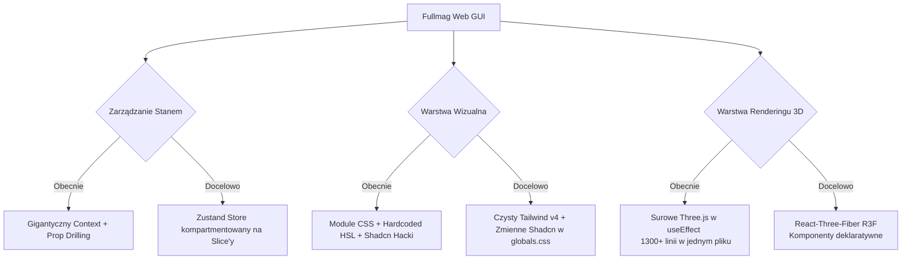

# Głęboki Audyt Architektury UI/UX: Fullmag Web 

Ten dokument stanowi wnikliwą, systemową analizę frontendu aplikacji Fullmag. Odchodzimy od powierzchownych ocen kolorystyki, a wnikamy w sam rdzeń architektury Reacta, zarządzania stanem, renderowania 3D oraz kaskadowych arkuszy stylów. Celem audytu jest wyeliminowanie ciężkiego długu technologicznego i zaprojektowanie architektury gotowej na wdrożenie standardów projektowych klasy "Premium" dla narzędzi inżynieryjnych.

---

## 1. Architektoniczny Dług Technologiczny (Analiza Kodu)

Aplikacja tkwi w architektonicznym rozkroku pomiędzy tradycyjnymi aplikacjami SPA z 2018 roku (CSS Modules, Prop Drilling, Raw WebGL) a nowoczesnym stosem Next.js (Tailwind v4, Server Components, Shadcn UI). 

### 1.1. Kryzys Zarządzania Stanem i Prop-Drilling
Zbadano plik `components/runs/RunControlRoom.tsx` oraz `FemWorkspacePanel.tsx`. Choć aplikacja definiuje potężny kontekst `ControlRoomContext`, to i tak przekazuje dziesiątki właściwości (props) w dół drzewa wizualnego.

**Dowód z `RunControlRoom.tsx`:**
```tsx
const viewportBarProps: ViewportBarProps = {
  isMeshWorkspaceView: ctx.isMeshWorkspaceView,
  meshName: ctx.meshName,
  effectiveFemMesh: ctx.effectiveFemMesh,
  // ... ponad 30 kolejnych zmiennych przypisywanych ręcznie 1:1 z kontekstu!
  activeMaskPresent: ctx.activeMaskPresent,
};
```
**Diagnoza UX/DevX:** Taki wzorzec to tzw. *Prop Drilling Anti-Pattern*. Skutkuje to ogromnym narzutem na utrzymanie. Każda nowa funkcja UI (np. nowy przycisk na RibbonBar) wymaga modyfikacji interfejsów w 4 różnych plikach. Co więcej, przy każdej zmianie pojedynczej zmiennej w koszmarnie dużym kontekście, React re-renderuje niemal całe drzewo robocze, co potencjalnie zacina interfejs na słabszych maszynach użytkowników podczas szybkich akcji (np. przeciągania suwaka opacity).

### 1.2. Technologiczny Koszmar Renderowania 3D (Raw Three.js vs React)
Rozwiązanie zaimplementowane w `components/preview/FemMeshView3D.tsx` to 1333 linie niemal czystego, imperatywnego kodu Three.js uwięzionego wewnątrz kilkunastu bloków `useEffect`. 

```tsx
// Z FemMeshView3D.tsx (Linie 409-540)
useEffect(() => {
  const scene = new THREE.Scene();
  const camera = new THREE.PerspectiveCamera(...);
  const renderer = new THREE.WebGLRenderer(...);
  // Imperatywne mutacje przez tysiąc linii...
  function animate() {
    animIdRef.current = requestAnimationFrame(animate);
    controls.update();
    renderer.render(scene, camera);
  }
  // ...
});
```
**Diagnoza UX/DevX:** Manualne zarządzanie cyklem życia Three.js (`dispose()`, `cancelAnimationFrame`) w epoce Reacta to proszenie się o gigantyczne wycieki pamięci po kilku przejściach między widokami siatki. Ponadto wymusza to imperatywne re-kalkulacje geometrii (np. ręczne przepinanie wektorów strzałek przez `InstancedMesh`), zamiast poddawać je deklaratywnemu cyklowi Reacta. Skutek dla użytkownika: zamrożenia klatek (frame drops) podczas wczytywania dużych siatek (mesh) oraz niereponsywność kontrolek paneli podczas obrotów kamery.

### 1.3. Rozbicie Konwencji Stylowania i Wirus BEM w Tailwindzie
Badając `Button.module.css` oraz `RibbonBar.tsx`, widoczny jest całkowity chaos koncepcyjny. Programiści dodali nowiuteńki **Tailwind CSS v4** oraz zainicjalizowali **Shadcn UI** (`components.json`), a mimo to 90% aplikacji z premedytacją omija te narzędzia na rzecz `module.css` pisanych w archaicznej metodyce zbliżonej do BEM.

**Dowód (Brak Single Source of Truth w Kolorach w `ScalarPlot.tsx`):**
```tsx
function getTheme() {
  const s = getComputedStyle(document.documentElement);
  const v = (prop: string, fallback: string) => s.getPropertyValue(prop)?.trim() || fallback;
  return {
    bg: v("--ide-bg", "#060d18"),
    accent: v("--ide-accent", "#3b82f6"),
    // Aplikacja polega na stringach z CSS, zamiast na wbudowanych tokenach Tailwinda!
  };
}
```

---

## 2. Docelowa Architektura Interfejsu (Master Plan)

Aby doprowadzić Fullmag Web do poziomu profesjonalnego oprogramowania SaaS ("Premium Design"), potrzebujemy radykalnej restrukturyzacji. Oto wykres planowanej architektury:



### KROK 1: Morderstwo `module.css` i Wymuszenie Ekosystemu Shadcn
Wszystkie systemy bazuące na starszym podejściu należy usunąć. Do `app/globals.css` zostanie wstrzyknięty spójny system tokenów Shadcn oparty na definicjach `@theme` dostępnych w Tailwind v4. 
Paleta kolorów przejdzie z przypadkowych "brudnych granatów" do profesjonalnej, spójnej optycznie palety z rodziny Zinc/Slate.

### KROK 2: Refaktoryzacja Komponentów do standardu CVA
Zamiast ręcznych `className={s.mojButton}`, użyjemy `class-variance-authority` (cva), który jest standardem w Shadcn:

**Designerski Button przed refaktoryzacją:**
Zajmuje 114 linii CSS i 40 linii TSX. Jest nieresponsywny na motywy zewnętrzne.

**Designerski Button po refaktoryzacji (Zgodny z Shadcn UI):**
Wymaga 0 linii CSS.
```tsx
import { cva, type VariantProps } from "class-variance-authority"

const buttonVariants = cva(
  "inline-flex items-center justify-center rounded-md text-sm font-medium transition-colors focus-visible:outline-none focus-visible:ring-1 focus-visible:ring-ring disabled:pointer-events-none disabled:opacity-50",
  {
    variants: {
      variant: {
        default: "bg-primary text-primary-foreground shadow hover:bg-primary/90",
        destructive: "bg-destructive text-destructive-foreground shadow-sm hover:bg-destructive/90",
        outline: "border border-input bg-transparent shadow-sm hover:bg-accent hover:text-accent-foreground",
        ghost: "hover:bg-accent hover:text-accent-foreground",
        glass: "bg-card/50 backdrop-blur-md border border-white/10 shadow hover:bg-white/10", // <--- Premium Feel!
      },
      size: { default: "h-9 px-4 py-2", sm: "h-8 rounded-md px-3 text-xs" },
    },
    defaultVariants: { variant: "default", size: "default" },
  }
)
```

### KROK 3: Naprawa Paradygmatu Glassmorphism ("Premium Feel")
Aby interfejs Control Room wyglądał wspaniale i przestrzennie nad rzutnią 3D, wymagane jest pełne oddzielenie przezroczystości strukturalnej od kolorów komponentów. Obecnie aplikacja stosuje stałe kolory teł, ewentualnie manualnie dokłada `hsla()`.

**Rozwiązanie:** 
Panele nawodne (Floating Panels, Toolbars) będą używały kombinacji utility classes:
`bg-background/80 backdrop-blur-xl border-border/50 shadow-2xl`
Dzięki jednolitemu systemowi Shadcn, ten sam styl zaaplikuje się bezbłędnie zarówno na wykresach (`ScalarPlot`), pasku bocznym jak i oknach typu modalnego, nie powodując zgrzytów kolorystycznych między "strefą AMUMAX" a "strefą IDE".

### KROK 4: React-Three-Fiber (R3F) Refactor dla `FemMeshView3D.tsx`
Ten monstrualny plik musi zostać zdekonstruowany w duchu Reacta, co drastycznie poprawi czas ładowania sceny i płynność (UX).

Zamiast gigantycznej funkcji budującej siatkę imperatywnie:
```tsx
// PRZYSZŁA STRUKTURA R3F (Zalecana)
export function FemMeshView3D({ meshData, renderMode ...}) {
  return (
    <Canvas>
      <PerspectiveCamera makeDefault position={[5, 5, 5]} />
      <OrbitControls makeDefault />
      <ambientLight intensity={0.5} />
      <directionalLight position={[2, 5, 2]} intensity={1} />
      
      <FemGeometry meshData={meshData} />
      {renderMode === 'surface+edges' && <FemEdges meshData={meshData} />}
      {showArrows && <FemVectorSpikes meshData={meshData} />}
      
      {clipEnabled && <ClippingPlane axis={clipAxis} pos={clipPos} />}
    </Canvas>
  )
}
```
Takie podejście ucina 70% kodu typu *boilerplate* i drastycznie redukuje szanse na "ścinanie" interfejsu przeglądarki podczas przeliczania gradientów map mapowania (Colormaps) z powodu lepszego zarządzania `useMemo` dla buforów geometrii.

---

## 3. Szczegółowe Podsumowanie Interwencji (Roadmapa)

Aby dostarczyć "Premium Experience", nie można pójść na skróty. Należy podjąć następujące operacje chirurgiczne:

1. **Wdrożenie Architektur CSS (Dzień 1)**
   Oczyszczenie `globals.css` ze zmiennych `--ide*`, `--am*`. Stworzenie jednego źródła prawdy (`--primary`, `--background`, `--card`, itd). Integracja pełnego pakietu Shadcn UI.
   
2. **Eksterminacja CSS Modules (Dzień 2)**
   Przejście plik po pliku i zamiana `<div className={s.meshCard}>` na predefiniowane komponenty `<Card className="backdrop-blur-md bg-card/50">`.

3. **Naprawa Danych ECharts (Dzień 3)**
   Pozbycie się funkcji `getTheme()` używającej API DOM. EChrat objęty zostanie wrapperem słuchającym zmian systemowych (Theme Context z Tailwind), przerysowując kanwę na zdarzenie z hooka. Od strony UX da to natychmiastowe przejścia kolorów.

4. **Wielki Refaktoring 3D (Dzień 4-6)**
   Przejście na ekosystem `react-three-fiber` oraz `react-three-drei`.

Dopiero wdrożenie Tych zmian zagwarantuje wam stabilność oprogramowania i pozwoli bezboleśnie dowozić nowe, wizualnie porywające "ficzery".
